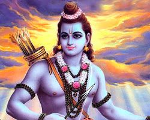

When Lord Rama returned to Ayodhya after defeating Ravana, the entire city was overjoyed. The people had been waiting for his return for 14 years, and they were eager to see him again.

The Sun God was also there to greet Lord Rama. He was so entranced by Lord Rama's beauty that he forgot to set in the west. As a result, the day continued for an entire month.

The Moon God was very disappointed that he had missed out on seeing Lord Rama. He went to Lord Rama and asked him why he had not been able to see him.

Lord Rama told the Moon God that he would grant his wish in his next incarnation. He said that he would appear on a full moon night, and the Moon God would be able to see him then.

The Moon God was very happy. He knew that Lord Rama was a merciful god, and he was confident that he would keep his promise.

The moral of the story is that Lord Rama is a merciful god who cares for his devotees. He even cares about the small wishes of his devotees, and he will always fulfill them.